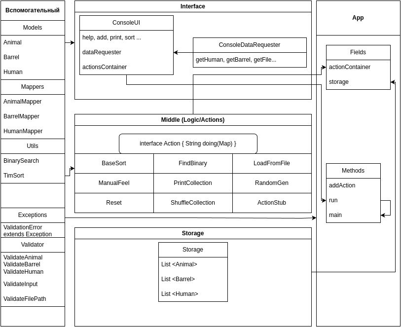

# aston1
Репозиторий совместной работы группы Астон_ступень1_поток17

# Задание.
Написать приложение, которое будет реализовывать алгоритм сортировки по переданным классам.

Приложение должно быть выложено на гитхаб/гитлаб,
количество веток с кодом должно соответствовать количеству участников (минимум),
все ветки в итоге должны быть смерджены в master/main ветку.

* Вся архитектура и код стайл должны соответствовать конвенциям языка Java.
* Программа должна выполняться в цикле.
* Выход из цикла возможен только путем соответствующего выбора пользователя.
* Пользователь должен иметь возможность выбирать варианты заполнения исходного массива данных (из файла, рандом, вручную) и его длину.
* Также у пользователя должна быть возможность найти какой-либо элемент отсортированной коллекции при помощи алгоритма бинарного поиска, которые также необходимо реализовать.
* Сортировки и бинарный поиск должны быть реализованы с использованием дженериков и быть универсальными под любые классы.
* В программе должен использовать паттерн стратегия.
* Сортировать необходимо кастомные классы - класс должен иметь реализованный паттерн Builder.
* Для вводимых данных (в тч из файла) должна производится валидация данных.

### Доп. задание:
* дополнительно к основным сортировкам реализовать эти же алгоритмы сортировки таким образом, что классы будут сортироваться по какому-либо числовому полю таким образом, что классы с четными значениями будут сортироваться в натуральном порядке, а с нечетными оставаться на своих местах.

## Классы:
* Животное (Вид, Цвет глаз, Шерсть (boolean)),
* Бочка (Объем, Хранимый материал, Материал из которого изготовлена),
* Человек (Пол, Возраст, Фамилия)

### Сортировка:
* **TimSort**

# Решение.

[](https://asciinema.org/a/mX4Uydp21au66gS7A6DgP8B1F)

Проект реализован на основе трех-слойной архитектуры:

* Интерфейс
* Средний слой (логика)
* Хранилище





### Описание.
При проектировании заданных моделей использовался шаблон Builder.

Для регистрации действий (actions/ callback) на запросы пользователя
использовался шаблон Strategy.


### Сборка.
Находясь в каталоге проекта, выполнить в консоли:

```
mvn package
```

### Запуск.
Находясь в каталоге проекта, выполнить в консоли:

Linux:

```
java -cp "target/AstonStage1Project-1.0-SNAPSHOT.jar:target/dependency/*" ru.astonstage1project.App
```

Windows:

```
java -cp "target/AstonStage1Project-1.0-SNAPSHOT.jar;target/dependency/*" ru.astonstage1project.App
```

### Формат файлов для загрузки данных.

Данные коллекций так же можно загрузить из файла в формате json.

При этом нужно учитывать, что имя файла должно заканчиваться расширением ".json"

А содержимое должно быть в таком формате:

для Animal
```
[
	{"species":"someSpecies","eyescolor":"green","wool":true}
]
```

для Barrel
```
[
	{"volume":32,"storedmaterial":"wood","barrelMaterial":"oil"}
]
```

для Human
```
[
	{"sex":"male","age":32,"surname":"Иванов"}
]
```