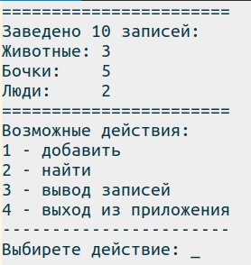
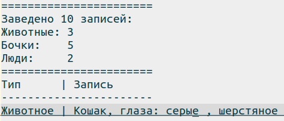
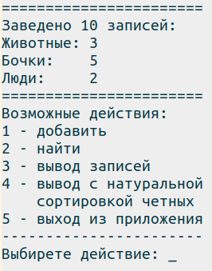

## Консольный интерфейс.

#### При запуске выводится 

## Алгоритмы обработки действий.

#### Добавить.
* Источник:

	1. Из файла
	2. Автогенерация
	3. Ручной ввод

	Из файла:
		
		Полный путь до файла: _
		Формат:
			1. csv
			2. json
	
	Автогенерация:

		Тип:
			1. Животное
			2. Бочка
			3. Человек
		Количество: _

	Ручной ввод:

		Тип:
			1. Животное
			2. Бочка
			3. Человек
		Поле1(название из типа):
		Поле2(название из типа):
		Поле3(название из типа):
		Подтверждение:
			Тип
				Поле1
				Поле2
				Поле3
			Сохраняю(y/n):

#### Найти

	Тип:
		1. Животное
		2. Бочка
		3. Человек
		4. Любой
	Содержит: _

	Результат:

## Дополнительное задание.

