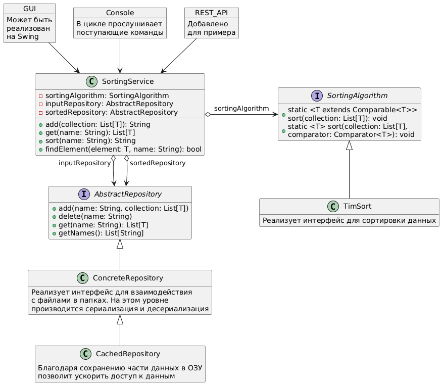

# Мысли по проекту

1. Программа может работать в трёх независимых режимах:
   - Ввод данных;
   - Сортировка данных;
   - Поиск по сортированному массиву; 
   - \+ Дополнительные настройки программы.

2. Хранить данные можно в формате JSON в отдельных папках (для введённых одна, для отсортированных другая).\
Наименования данных можно осуществлять в виде "23:18:24_12.09.2024" (для отсортированных постфикс "_sorted":
    ```json
    [
      {
        "model": "animal",
        "property": {
          "species": "cat",
          "eyes_color": "brown",
          "wool": "black"
        }
      },
      {
        "model": "animal",
        "property": {
          "species": "dog",
          "eyes_color": "black",
          "wool": "white"
        }
      }
    ]
    ```
    - В таком виде можно как хранить данные введённые вручную и рандомом, так и принимать данные, поставляемые в виде файла.

3. Ввод параметров можно осуществлять как с помощью консоли, так и с помощью какого-нибудь простенького GUI (например, на Swing):

    - Пример работы в консоли:

    ```
    >> add
    >> Выберите метод ввода (manual, file, random): manual
    >> Введите тип объектов: animal
    >> Введите количество объектов: 13
    >> === Ввод данных animal №1 ===
    >> Введите вид животного: dog
    >> Введите цвет глаз животного: red
    >> Введите шерсть животного: black
    >> === Ввод данных animal №2 ===
    ...
    >> Набор данных "23:18:12_12.09.2024" успешно сохранён
    >> add
    >> Выберите метод ввода (manual, file, random): file
    >> Введите путь к файлу: C:\Users\username\Desktop\data.json
    >> Набор данных "23:19:24_12.09.2024" успешно сохранён
    >> sort
    >> === Список доступных коллекций ===
    >> 1. 23:18:12_12.09.2024: animal
    >> 2. 23:19:24_12.09.2024: human
    >> Выберите коллекцию для сортировки: 1
    >> === Отсортированный список объектов типа animal ===
    >> 1. Animal{species="Dog", eyes_color="Red", wool="Red"}
    >> 2. Animal{species="Dog", eyes_color="Red", wool="Yellow"}
    >> 3. Animal{species="Dog", eyes_color="White", wool="Brown"}
    ...
    >> find 
    >> === Список доступных отсортированных коллекций ===
    >> 1. 23:18:12_12.09.2024_sorted: animal
    >> 2. 23:19:24_12.09.2024_sorted: human
    >> Выберите коллекцию для поиска: 2
    >> === Ввод данных human ===
    >> Введите пол человека: мужской
    >> Введите возраст человека: 43
    >> Введите фамилию человека: Яблоков
    >> Объект с данными параметрами успешно найден в коллекции "23:19:24_12.09.2024_sorted" 
    >> help
    >> === Список команд ===
    >> 1. add - Общая команда добавления коллекций
    >> 2. add manual - Добавить коллекцию вручную
    >> 3. add file - Добавить коллекцию из файла
    >> 4. add random - Добавить коллекцию со случайными значениями
    >> 5. delete - Удалить коллекцию
    >> 6. find - Найти элемент в отсортированной коллекции
    >> 7. sort - Отсортировать колекцию
    >>
    ```
   
    - При использовании GUI можно было бы работу приложения сделать более презентабельной. 

4. Ядро программы, в идеале, должно быть лишено зависимостей от реализации взаимодействия с пользователем (консольное приложение, REST API, GUI). \
Для этого нужно разделить приложение на несколько уровней:



Исходный код схемы на языке PlantUML:
```plantuml
object GUI {
    Может быть 
    реализован
    на Swing
}
object Console {
    В цикле прослушивает 
    поступающие команды
}
object REST_API {
    Добавлено 
    для примера
}

class SortingService {
    - sortingAlgorithm: SortingAlgorithm
    - inputRepository: AbstractRepository
    - sortedRepository: AbstractRepository
    + add(collection: List[T]): String
    + get(name: String): List[T]
    + sort(name: String): String
    + findElement(element: T, name: String): bool
}

interface SortingAlgorithm {
    + static <T extends Comparable<T>>\nsort(collection: List[T]): void
    + static <T> sort(collection: List[T], \ncomparator: Comparator<T>): void
}

class TimSort {
    Реализует интерфейс для сортировки данных
}

interface AbstractRepository {
    + add(name: String, collection: List[T])
    + delete(name: String)
    + get(name: String): List[T]
    + getNames(): List[String]
}

class ConcreteRepository {
    Реализует интерфейс для взаимодействия
    с файлами в папках. На этом уровне
    производится сериализация и десериализация
}

class CachedRepository {
    Благодаря сохранению части данных в ОЗУ
    позволит ускорить доступ к данным
}

GUI --> SortingService
Console --> SortingService
REST_API --> SortingService
SortingService o-right-> SortingAlgorithm: sortingAlgorithm
TimSort -up-|> SortingAlgorithm
SortingService "inputRepository" o--> AbstractRepository
SortingService "sortedRepository" o--> AbstractRepository
ConcreteRepository -up-|> AbstractRepository
CachedRepository-up-|> ConcreteRepository

hide SortingAlgorithm fields
hide TimSort methods
hide AbstractRepository fields
hide ConcreteRepository methods
hide CachedRepository methods
```
